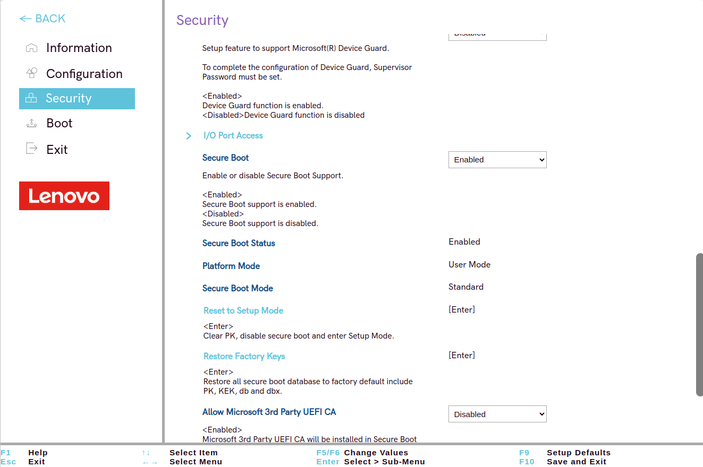

# Guía para bastionar la BIOS/UEFI 

## Introducción

En esta guía aprenderás a configurar de forma segura la BIOS/UEFI de un ordenador. Dado que no pude acceder a la BIOS de mi máquina directamente, utilicé un emulador de BIOS de una máquina Lenovo Legion para completar los pasos. El objetivo es incrementar la seguridad del sistema mediante contraseñas, control de dispositivos de arranque, y activación de "Secure Boot".

## Pasos para acceder a la BIOS

1. **Reinicia tu ordenador.**
2. Mientras se enciende, presiona la tecla correspondiente para acceder a la BIOS/UEFI (generalmente `F2`, `F10`, `Delete` o `Esc` según el fabricante de tu equipo).
3. Una vez dentro de la BIOS, utiliza las teclas de dirección para navegar por los menús.

> **Nota:** En mi caso, no pude acceder directamente a la BIOS de mi dispositivo y, por lo tanto, utilicé un emulador de BIOS de Lenovo Legion.

## Configuración de la contraseña de administrador

1. Una vez que estés en la bios, le darás a el boton de abajo a la derecha que se llama "More Setting" y accederas a el menú de configuración avanzada

2. Navega al menú de **Security** y selecciona la opción **Administrator Password**.

3. Introduce una nueva contraseña segura. Esta contraseña se solicitará para cualquier modificación en la BIOS.
   
   

3. Confirma la contraseña y guarda los cambios presionando `F10`.

## Configuración de la contraseña de disco duro (HDD Password)

1. Para proteger los datos en el disco duro, selecciona **HDD Password** en el menú **Security**.

2. Ingresa una contraseña para el disco duro Esta medida asegura que si el disco es extraído, no podrá ser accedido sin la contraseña.

## Otras opciones de seguridad disponibles

Hay algunas configuraciones, el cual no necesitan mucha información y esas configuraciones son :

### **Natural file guard**
- **Enabled/Disabled**: Si está activado, los discos duros no solicitarán la contraseña para continuar con el arranque del sistema operativo, pero se recomienda configurar la autenticación del usuario en el sistema operativo.

### **Security erase HDD1 Data**
- Opcion para borrar de manera segura los datos del disco duro.

### **Set strong password**
- **Enabled**: Exige que las contraseñas de administrador, usuario y disco duro tengan al menos 8 caracteres, incluyan mayúsculas, minúsculas y números.

### **AMD Platform Security Processor**
- **Enabled/Disabled**: Controla el AMD PSP para gestionar la seguridad del hardware.

### **Pluton**
- **Enabled/Disabled**: Activa el módulo de seguridad de Microsoft.

### **Absolute Persistence® Module Activation**
- **Enabled/Disabled/Permanently Disabled**: Controla la activación del Absolute Persistence® Module para protección de software.

### **Device Guard**
- Configura la función de **Device Guard** de Microsoft para mejorar la seguridad del dispositivo.

## Activación del secure boot

1. Navega al menú **Boot** o **Security** y selecciona **Secure Boot**.
2. Activa la opción **Secure Boot** para garantizar que el sistema solo arranque software firmado.
   
   

## Guardar los cambios y salir

1. Una vez que hayas configurado todas las opciones necesarias, presiona `F10` para guardar los cambios y salir.
   
   

2. Confirma seleccionando **Yes** para aplicar las configuraciones.

---

## Conclusión

Siguiendo estos pasos, habrás configurado la BIOS/UEFI de tu equipo para que sea más segura, con contraseñas de protección y opciones de arranque restringidas. Este proceso asegura que tu equipo esté protegido frente a accesos no autorizados, tanto en el arranque como en el acceso físico a los datos.

